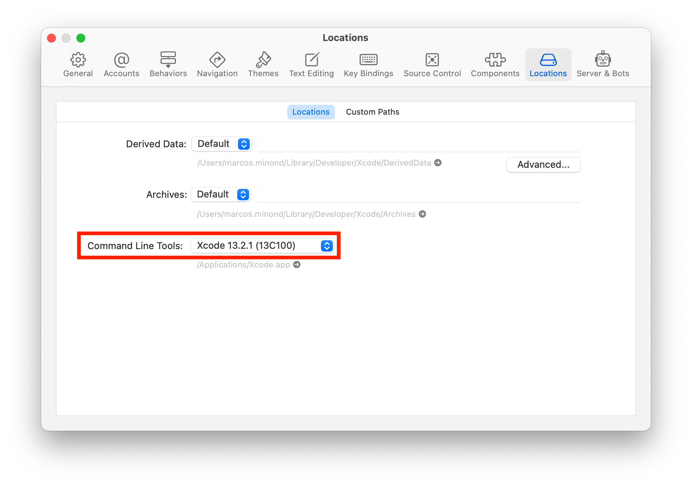
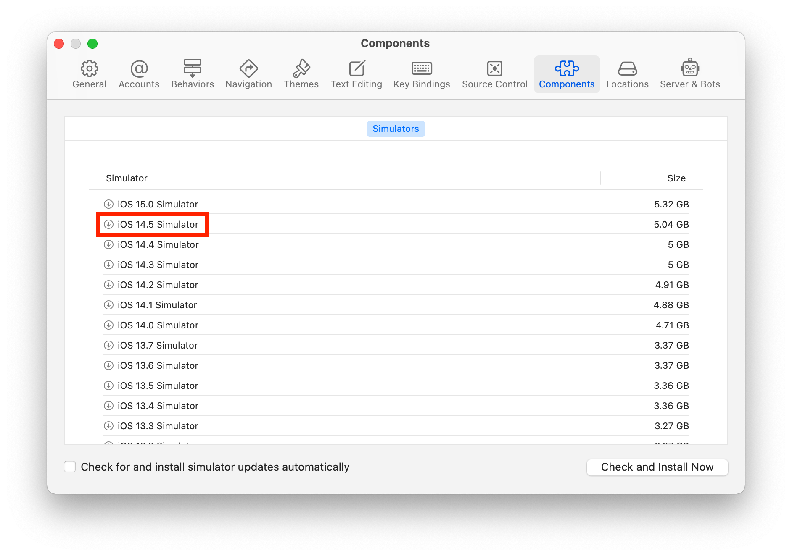

# Setting up your environment

This document will walk you though how to set up your environment so that you
can run the example React Native application in a simulator.


## Installing dependencies

You will need the following programs installed before we can proceed. If you
already have a dependency installed, then verify you're on the version that is
expected. See sections below for further instructions.


### 1. Xcode

You can download and install Xcode from the App Store in your computer. Make
sure you install the latest version of Xcode. Also make sure to not install the
beta.


### 2. Xcode Command Line Tools

If you already had Xcode and the Command Line Tools installed, then proceed to
the next step.

After installing Xcode, execute the command below to install the command line
tools provided by Xcode:

```
xcode-select --install
```


### 3. Select Command Line Tools location in Xcode

Open Xcode and go to the Preferences (<keyboard>command + comma</keyboard>),
then go to the "Locations" tab and ensure you have an option selected in the
"Command Line Tools" select field. Pick the option with the latest version
number.




### 4. iPhone simulator

If you have already installed an iPhone simulator, then you can proceed to the
next step.

Open Xcode and go to the Preferences (<keyboard>command + comma</keyboard>),
then go to the "Components" tab and select and install a recent version of iOS
(that's version 14.x at the time of writing). This will take a few minutes.




### 5. brew

If you already have brew installed (run `brew --version` and make sure there
are no errors), then proceed to the next step.

Go to https://brew.sh/ and execute the command listed in the installation
section. Alternatively, you can copy it from here:

```
/bin/bash -c "$(curl -fsSL https://raw.githubusercontent.com/Homebrew/install/HEAD/install.sh)"
```


### 6. Node

If you have installed Node in the past, then just make sure you have Node v16
or v17. Node v16 is recommented since it has LTS but v17 is supported as well.

Go to https://nodejs.org/en/download/ and download the Node installer for
macOS. Make sure you install Node v16 (for example, v16.14.0). Alternatively,
you can install a Node version manager, such as nvm
(https://github.com/nvm-sh/nvm), or through brew. All methods work as long as
you install Node v16 (or v17). Below you will find the command to install Node
with brew.

```
brew install node@16
```


### 7. Ruby

If you have installed Ruby in the past, then just make sure you have Ruby
v2.7.

Go to https://www.ruby-lang.org/en/documentation/installation/ and follow the
instructions for installing Ruby with brew. Make sure you install Ruby v2.7
(for example, v2.7.5). Alternatively, you can install a Ruby version manager,
such as rbenv (https://github.com/rbenv/rbenv) or rvm (https://rvm.io/), or
through brew. All methods work as long as you install Ruby v2.7. Below you will
find the command to install Ruby with brew.

```
brew install ruby@2.7
```


### 8. CocoaPods

If you have installed CocoaPods in the past, then just make sure you have the
lastest version (that's version 1.11.x at the time of writing).

Go to https://guides.cocoapods.org/using/getting-started.html and execute the
command listed in the installation section. Below you will find the command to
install CocoaPods with gem. Make sure you're on Ruby 2.7 before you do this.

```
sudo gem install cocoapods
```


## Checking dependencies

Once all of those dependencies have been installed, run the following commands
and ensure they all succeed and print a version number. The versions you get
should roughly match the versions I include below. If there's a mismatch in a
version, everything may still work, but if it doesn't know that this may be the
reason.

```bash
xcode-select --version
# => xcode-select version 2392.

node --version
# => v16.11.1

brew --version
# => Homebrew 3.3.6
# => Homebrew/homebrew-core (git revision 5b7a40e0b24; last commit 2021-11-30)
# => Homebrew/homebrew-cask (git revision 87e1b9b492; last commit 2021-11-30)

ruby --version
# => ruby 2.6.1p33 (2019-01-30 revision 66950) [x86_64-darwin20]

pod --version
# => 1.11.2

git --version
# => git version 2.32.0 (Apple Git-132)
```
